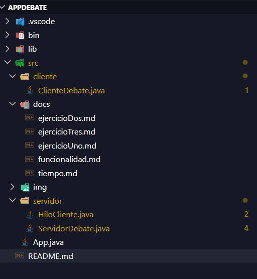
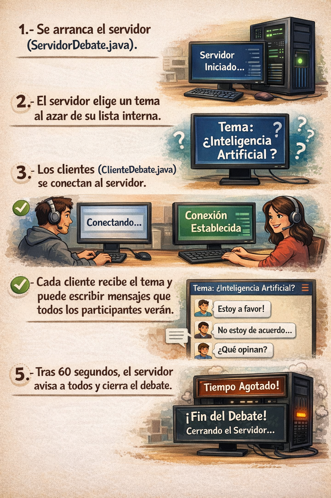
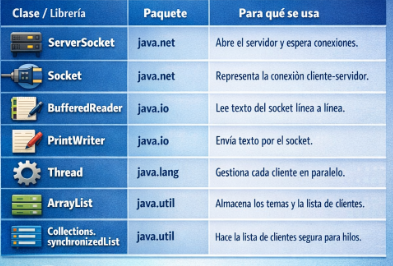

# Aplicación de Debate – Cliente/Servidor con Sockets

## Descripción
Esta aplicación permite que varios usuarios debatan en tiempo real sobre un tema elegido al azar por el servidor. El debate tiene una duración fija de 1 minuto, tras el cual el servidor cierra automáticamente todas las conexiones.
Está desarrollada en Java, usando sockets para la comunicación en red e hilos para gestionar varios clientes a la vez.

## 📁 Estructura del proyecto

## ⚙️ Funcionamiento de la APP

## Roles de cliente y servidor
Roles del cliente y del servidor
## Servidor

Abre el puerto y espera conexiones.
Elige el tema del debate al azar.
Crea un hilo por cada cliente que se conecta.
Retransmite los mensajes de un cliente a todos los demás.
Gestiona el temporizador y cierra el debate al finalizar.

## Cliente

Se conecta al servidor con un nombre de usuario.
Recibe el tema y los mensajes de otros participantes.
Envía mensajes al debate que todos pueden leer.
Puede desconectarse voluntariamente escribiendo salir.

## Liberias utilizadas para la APP

## Control de Excepciones

| Excepción                | Dónde ocurre | Por qué                                                             |
| ------------------------ | ------------ | ------------------------------------------------------------------- |
| **ConnectException**     | Cliente      | El servidor no está encendido cuando el cliente intenta conectarse. |
| **SocketException**      | Servidor     | El ServerSocket se cierra al acabar el tiempo del debate.           |
| **IOException**          | Ambos        | Errores generales de red o desconexiones inesperadas.               |
| **InterruptedException** | Hilos        | Un hilo se interrumpe durante `Thread.sleep`.                       |

## Comandos del cliente
Comando -> Cualquier texto / Accion -> Se envia mensaje al debate.

Comando -> Salir / Desconectar al cliente del debate.

# Notas

El servidor escucha en el puerto 5000. Asegúrate de que no está siendo usado por otra aplicación.
Para cambiar la duración del debate, modifica la constante TIEMPO_DEBATE en ServidorDebate.java.
El cliente y el servidor deben estar en la misma red para conectarse. Si quieres probarlo entre dos ordenadores distintos, cambia localhost por la IP del servidor en ClienteDebate.java.

# Aplicacion creada por:
### Gabriel David Gelviz Monterrey