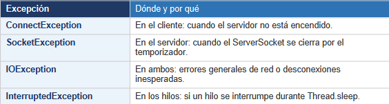

## Temporizador y cierre automático

# ¿Qué se hizo?
Se añadió un hilo temporizador al servidor. Este hilo espera 60 segundos (usando Thread.sleep) y luego avisa a todos los clientes de que el debate ha terminado, cerrando el ServerSocket para que el bucle principal se detenga.

# Pasos realizados
    • Se creó un hilo temporizador con Thread.sleep(60 * 1000).
    • Se marcó como setDaemon(true) para que no bloquee el cierre del programa.
    • Al despertar, llama a avisarFinDebate() que recorre la lista y manda un mensaje a cada cliente.
    • Luego cierra el ServerSocket, lo que provoca una SocketException en el bucle principal.
    • Se captura esa excepción con try-catch para cerrar limpiamente.

# Fragmento clave
Thread temporizador = new Thread(() -> {
    Thread.sleep(TIEMPO_DEBATE * 1000L);
    avisarFinDebate();
    serverSocket.close();
});
temporizador.setDaemon(true);
temporizador.start();

# Control de excepciones
Se capturan las siguientes excepciones a lo largo del proyecto:

